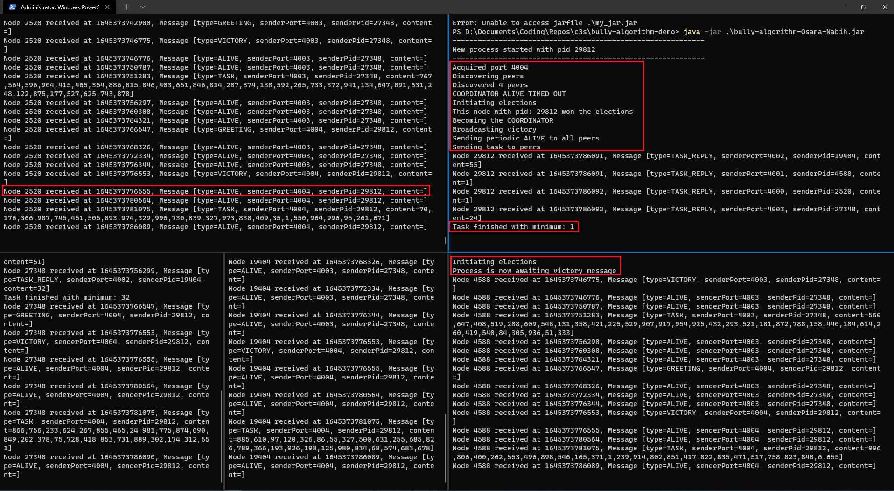

# bully-algorithm-demo
Java implementation of the Bully Algorithm for determining a Coordinator in a distributed network. <br>
All configuration is defined inside "Consts.java" file. <br>
Feel free to play around with the parameters.

## Limitations/Assumptions
- There's a finite number of N nodes (where N can be arbitrarily large).
- Each node knows the range of ports the nodes occupy (by defining a start port and max number of nodes variables).
- If a node crashes before sending the coordinator the answer to its chunk, the coordinator announces the minimum of all the responses it received (from the other working nodes).
- Any node can crash at any time, including the coordinator. The operation should be robust enough to continue normally, even if it takes a few message exchanges to reach steady state.
- When a new node joins the network, it starts a new election (even though in my code it already knows whether or not it has the highest PID), since this was demanded explicity in your email regarding the task.
- If a node crashes, we don't start an election process, unless it was the coordinator node.
- A new task is only done when a node becomes the new _coordinator_. The task is not repeated afterwards as this was not demanded in the task.
## Architecture/Design
- Architecture is <b>decentralized (P2P)</b>, nodes directly communicate with each other, and any node listening on any port can become the coordinator.
- There is no fixed port for the coordinator.
- All communication is done through _sockets_ using TCP (to ensure no loss of data).
- Any sending IO work or CPU work is delegated to a dedicated thread. While the main thread does all the receiving. (Threads communicate among the same process and aren't used for any Inter-Process Communication). This is to avoid any blocking operations that sacrifice performance.
- In cases such as _broadcast_ and _task_ messages, I chose to allocate a thread to each node as opposed to doing it sequentially. This is to avoid cascading delays from timeouts when nodes crash. This may be suboptimal if the max number of nodes is large and the Rate of Failure is low. This is a tradeoff to be considered depending on the context.

## The Algorithm
- The coordinator periodically sends <b>ALIVE</b> messages to all other nodes.
- Each node has a timer, if the coordinator fails to send an ALIVE message in the specified time, the node assumes the coordinator is dead.
- If the node has the highest PID, it becomes the coordinator and sends a  VICTORY message to all the other nodes.
- Else, it starts a new election by sending an <b>ELECTION</b> message to all the nodes that have a higher PID than itself.
- When a node receives an <b>ELECTION</b> message
    - It replies with an <b>ANSWER</b> _only if_ the node asking for an election has a lower PID than itself, and then starts an _election_ process itself.
- When a node receives an <b>ANSWER</b> message from a process with higher PID, it stops sending <b>ELECTION</b> messages (stops electing itself), and waits for a <b>VICTORY</b> message. If no <b>VICTORY</b> message arrives, it re-starts the election process.
- If a node send an <b>ELECTION</b> message and receives no <b>ANSWER</b> messages, it becomes the new _coordinator_ and broadcasts a <b>VICTORY</b> message to all nodes (implemented in a threading manner).
- Any node that receives a <b>VICTORY</b> message treats the sender as the _coordinator_
- Once a new _coordinator_ is announced, it generates random N numbers and splits them evenly into chunks, sending 1 chunk to each process in a <b>TASK</b> message.
- The processes calculate the minimum number in their chunks by spawning a separate thread for this task, and send the result to the coordinator in a <b>TASK_REPLY</b> message.

## Accounting for failures
<ol>
    <li><b>At any time:</b> The threads responsible for sending the <b>ALIVE</b> messages inform the <em>coordinator</em> when a node is down. Note that the other nodes aren't informed of this failure, as this doesn't affect our simulation, as only the <em>coordinator</em> needs to know this information when sending the task.</li>
    <li><b>After receiving a chunk:</b> The <em>coordinator</em> starts a timer after sending the <b>TASK</b> messages. If the timer expires, it prints the minimum response it received while alerting the user that some nodes did not reply.</li>
    <li><b>Coordinator crashing:</b> All nodes have a timer, if they don't receive an <b>ALIVE</b> message during this time, they assume coordinator is dead, and a new election is started (by many nodes simultaneously)</li>
    <li><b>New coordinator crashing before sending victory:</b> Each node starts a timer when it receives an <b>ANSWER</b> from a node with higher PID and is thus awaiting a victory. If no victory is received, it starts a new election</li>
</ol>

## Typical Flow
<ol>
    <li> A new node process is started. </li>
    <li> The node searches over our entire port range, sends a GREETING msg to functioning nodes, and ignores unoccupied ports. </li>
    <li> Now all nodes know about our new node, and our node knows our entire network. </li>
    <li> The coordinator deliberately does not send <b>ALIVE</b> messages to any new node, in order to satisfy the requirement that new nodes should start a new election request in the task. </li>
    <li> The node with the highest PID wins and becomes the new coordinator. </li>
    <li> The new coordinator starts sending <b>ALIVE</b> messages periodically to all nodes. </li>
    <li> It also broadcasts a <b>VICTORY</b> message to all nodes. </li>
    <li> it generates an array of random ints and splits it into chunks, sending 1 chunk to each other node. </li>
    <li> Coordinator receives the minimum of each chunk and calculates the global array minimum and displays it. </li>
    <li> Steady state is reached. </li>
</ol>

## Testing
- Tested with several number of nodes (up to 10).
- Tested with relatively large arrays (up to 10K), any more than that the terminal gets flooded and timeouts occur due to receiver thread taking a long time to process the message content.
- Tested new node entering the network the highest PID.
- Testing any node failing at any time.
- Tested coordinator failing.
- Tested starting a new node at several stages of our flow.

## Running Instructions
Run the bully-algorithm-Osama-Nabih.jar file in any command line terminal using. <br>
```
java -jar bully-algorithm-Osama-Nabih 
```
You can run as many instances as you'd like

## Killing the coordinator
We can simply terminate any process, including the coordinator, by pressing Ctrl + C in the terminal, or closing the terminal window.

## Understanding the output
Each message is logged in the following format
```
Node <process_pid> received at <timestamp> Message [type=<msg_type>, senderPort=<msg_sender_port>, senderPid=<msg_sender_pid>, content=<msg_content>]
```
Important information is also logged, such as
- Any timeout.
- Any failing process.
- Starting a new election.
- Peers' discovery.
- Winning the elections.
- Becoming the coordinator.
- Victory broadcast.
- Starting the task.

## Output Example


## NOTES
I made decent refactoring effort to the code, by making a <b>State</b> abstract class and having <b>Init, Running, Electing, PendingVictory, and Coordinating</b> inherit from it, hence splitting the logic of each state entirely. <br>
This resulted in a <b>much</b> cleaner code, unfortunately I didn't have the time to test it.<br>
You can find that code in the _refactoring_ branch.